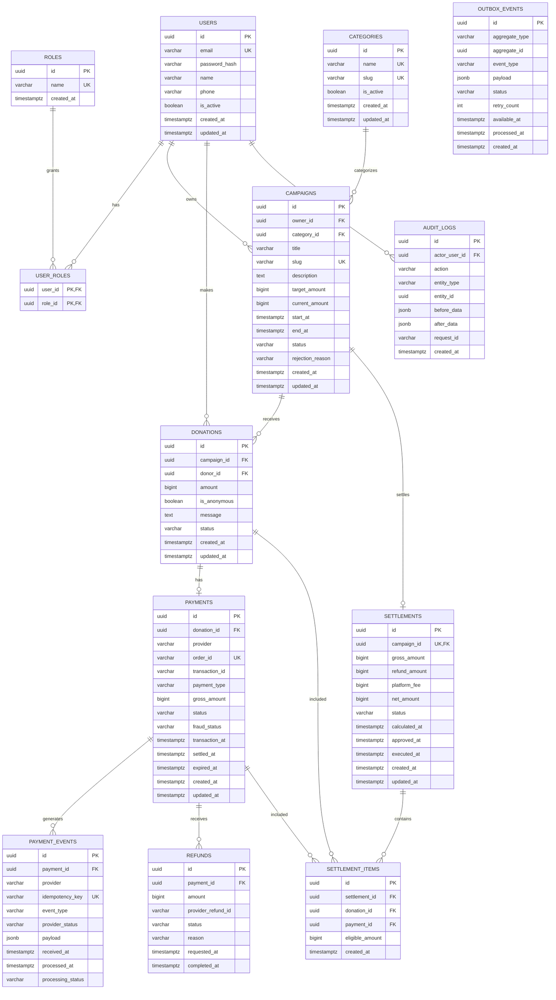

# CareFund — Entity Relationship Diagram (ERD)

**Version:** 1.0  
**Database:** PostgreSQL

## 1. Design Principles

1. PostgreSQL adalah authoritative data store.
2. Nominal uang menggunakan `BIGINT`, bukan floating point.
3. Foreign key wajib digunakan untuk integrity.
4. Financial records tidak boleh dihapus secara destructive.
5. Payment/provider event harus idempotent.
6. Settlement campaign bersifat 1:1.
7. Audit log bersifat append-only.
8. Status transition harus divalidasi oleh domain layer.

## 2. Core Entities

- users
- roles
- user_roles
- categories
- campaigns
- donations
- payments
- payment_events
- refunds
- settlements
- settlement_items
- outbox_events
- audit_logs

## 3. Mermaid ERD



## 4. Important Constraints

### Users

```sql
UNIQUE(email)
```

Email comparison should normally be case-insensitive. Prefer PostgreSQL `citext` or a normalized lowercase email strategy.

### Campaign

```sql
UNIQUE(slug)
CHECK(target_amount > 0)
CHECK(end_at > start_at)
```

### Donation

```sql
CHECK(amount > 0)
```

### Payment

```sql
UNIQUE(order_id)
CHECK(gross_amount > 0)
```

### Settlement

```sql
UNIQUE(campaign_id)
CHECK(gross_amount >= 0)
CHECK(refund_amount >= 0)
CHECK(platform_fee >= 0)
CHECK(net_amount >= 0)
```

A campaign can have at most one settlement.

### Refund

A refund must never make the total refunded amount exceed the payment amount.

This invariant is enforced by Go transaction logic with PostgreSQL row locking.

## 5. Financial Eligibility

Do not calculate settlement from all `DONATIONS` with `status = PAID` blindly.

Preferred eligibility:

```text
payment.status = SETTLED
AND payment.settled_at IS NOT NULL
AND payment is not fully refunded
```

For partial refund:

```text
eligible_amount = settled_amount - refunded_amount
```

## 6. Recommended Indexes

```sql
CREATE INDEX idx_campaigns_status_end_at
ON campaigns(status, end_at);

CREATE INDEX idx_donations_campaign_id
ON donations(campaign_id);

CREATE INDEX idx_donations_donor_id
ON donations(donor_id);

CREATE INDEX idx_payments_donation_id
ON payments(donation_id);

CREATE INDEX idx_payments_status
ON payments(status);

CREATE INDEX idx_payment_events_payment_id
ON payment_events(payment_id);

CREATE INDEX idx_outbox_events_status_available_at
ON outbox_events(status, available_at);

CREATE INDEX idx_audit_logs_entity
ON audit_logs(entity_type, entity_id);
```

## 7. Deletion Policy

Financial entities should not be hard-deleted:

- donations
- payments
- payment_events
- refunds
- settlements
- settlement_items

Use status transitions or archival policy instead.

## 8. ERD Implementation Notes

The ERD is intentionally designed so that:

```text
Donation
   ↓
Payment
   ↓
Payment Events
   ↓
Refund
   ↓
Settlement
```

can be audited end-to-end.
